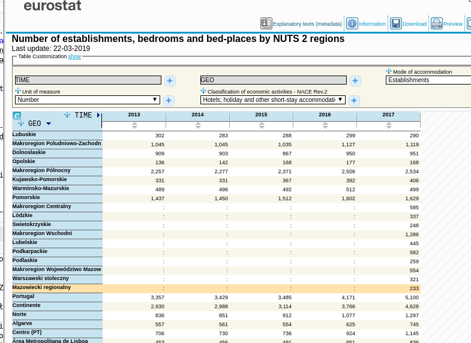
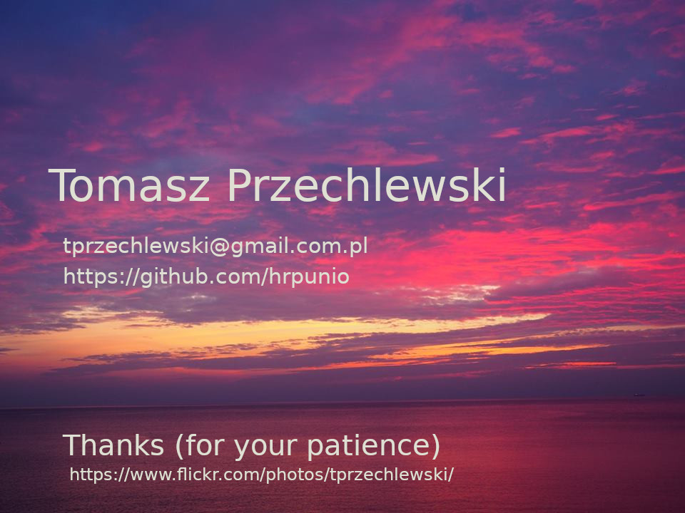

## Poor definitions: Full Time Equivalence (FTE)

Number of students.

**Who is a student?**

Student is a person attending to
a 3rd level status school in in the
3-stage education system (cf [Educational_stage](https://en.wikipedia.org/wiki/Educational_stage)).
The answer is still non-obvious as there are many
forms of tertiary education. For example:

The UNESCO stated that tertiary education focuses on learning
endeavors in specialized fields. It includes academic and higher
vocational education.

So according to the above definition the school do not belongs
to tertiary education if its status is not academic and/or higher
vocational. Example:  Dance Academy or
University for Elderly people (aka University of the 3rd Age).
Both are popular in Poland.

In many countries there are some certification scheme. For example
in Poland a school must apply (and get) a certificate to be
regarded as high school (ie part of tertiary level of education)

**Heads vs Majors**

Student can be enrolled to more than one course (major).
So for counting heads it is necessary  to remove duplicates
otherwise one would count majors not persons.

**Part time studies**

FTE stands for Full-Time-Equivalent, an approximation of the
number of students who would be enrolled full-time

Full time equivalent (FTE) -- FTE is based on student credit
hours. It is obtained by dividing student credit
hours by some a number of credit hours for full-time-study.

Conclusion: Majors, Persons or FTEs? Which is the best?

[University of Utah/Office of Analysis,
Assessment and Accreditation](http://www.usu.edu/aaa/about_our_data.cfm)
google:single multiple majors fte

## Measurement of tourism activity

**Who is a tourist**. According to
[Glossary:Tourism](https://ec.europa.eu/eurostat/statistics-explained/index.php/Glossary:Tourism)

Tourism means the activity of visitors taking a trip
to a main destination outside their usual environment,
for less than a year, for any main purpose, including business,
leisure or other personal purpose,
other than to be employed by a resident entity in the place visited.

According to the above definition to be regarded as tourist one has
to change her/his accommodation place for less than
one year (otherwise Eurostat would regard her/him as migrant)

The usual meaning (at least in Poland) is that tourist
is travelling for leisure not to work. People travelling to work
has other needs/aims than those travelling to rest
(they usually do not use hotels for example)
so the above definition solves some problems but at the same time
creates many others.

Number of tourists: do not distinguish between various form of tourists,
difficult to collect (who is a tourist anyway?)

## Concept of an indicator

Various `number of' tourist-oriented establishments
(hotels, catering units, beds,
nights spent) etc. They do not measure tourists per-se but
are highly related and more reliable (as easier to count).

Indicator of tourist activity (by various tourist types).

Conclusion: measurement of tourism activity is not trivial
Other similar: internet user, migrant, unemployed person,
illiterate person

NACE = Statistical Classification of Economic Activities =
the industry standard classification system used in the European Union.
NACE uses four hierarchical levels: SectionDivision.Group.Class, where Section
is denoted by a single letter. Examples:

* **A01.44** A = Agriculture, forestry and fishing (section); 01 = Crop and animal
production, hunting and related service activities (division); 01.4 = Animal
production (group); 01.44 = raising of camels and camelids (section)

* **I55.1** Accommodation and food service activities (I); Accommodation (55);
Hotels and similar accommodation (55.1)

## Sloppy measurement: measurement of tourism activity

Two sides of tourism: supply side (hotels) / demand side (tourists)

BTW: demand = how much a product/service is desired; 
supply = how much the market can offer

Tourism supply statistics (accommodation statistics): Data on rented accommodation ie. capacity and occupancy of tourist accommodation
establishments in the reporting country. How collected? Registers?

**How statistical data is collected?**: exhaustive data vs sample. **Exhaustive**:
dedicated sureys (obligatory reports) vs administrative 
registers (births, deaths, police statistics). Sample: representative sample
vs random sample vs panel data. Panels (cf [Panel Research](https://www.questionpro.com/blog/panel-research-why-it-matters/)). Panels are overused nowadys (cf https://panelariadna.pl/):

Quirks of data collection:
Data up to year 2015 inclusive refer to only those units that made the statistical reports.
Starting of data for January 2016,
the method of imputation data was implemented (ie replacing
missing data with some (possibly meaningful :-)) values.
(cf [BDL](https://bdl.stat.gov.pl/BDL/dane/podgrup/temat/18/240/2396))

Impu-what? Missing data problem

**Tourism demand statistics**: Data on participation in tourism of the residents of the reporting country.
How collected? Surveys?

Most of the time, data on domestic and outbound trips (where "outbound tourism" means residents of a country travelling in another country) is collected via sample
surveys (cf [Annual data on trips of EU residents](https://ec.europa.eu/eurostat/cache/metadata/en/tour_dem_esms.htm) and
[Tourism_statistics_-_top_destinations](https://ec.europa.eu/eurostat/statistics-explained/index.php/Tourism_statistics_-_top_destinations))

Regulations concerning data collection in tourism (hundreds of pages):
[Glossary:Supply_side_tourism_statistics](https://ec.europa.eu/eurostat/statistics-explained/index.php?title=Glossary:Supply_side_tourism_statistics)
and [EU regulation No 692/2011](https://eur-lex.europa.eu/legal-content/EN/ALL/?uri=CELEX:32011R0692)

So now we know what we are dealing with...

## Poor definitions: dreadful aggregates

Indicators can be divided to hard indicators and soft indicators.
*Hard indicators* denote hard facts while soft indicators are 
*beliefs* and *intentions*. For example number of hotels is a fact,
while intention to stay abroad less than a year is not a fact but an intention.
In Poland at least 80% respondents declares they intend to vote, while
the true turnover never exceed 55%. In other words measuring something using soft
indicators is prone to (significant) errors.
 
 That not means that hard indicator is error-free. By definition it measures not
 the phenomenon but some proxy associated with the phenomenon. 
 
 With hard indicator we have precise measurement of imprecise measure. With
 soft indicator we have imprecise measurement of imprecise measure.
 
 To cure (or hide) the problems aggregates of indicators are constructed,
 eiter as sums (*indexes* or *formative*) or as averages (factors or *reflective*. 
 Indexes are more popular in economics
 while averages/factors are more popular in psychology, sociology etc...
 
 For example Gross National Product (GDP) is an index
 while (customer) satisfaction defined as some set of opinions on a product would be a factor.
 
 Control question: what is measured with GDP?
 
 Collection methods from most to last reliable:

* administrative registers (almost all)

* some obligatory reports, some sample-based

* panels, obligatory reports when respondent is unable/unwill/ to provide information or take part at all), most sample-based (intensions, soft factors)

Typical collection method description of a sample based survey:
Data collected from 1st April to 2nd April 2019.
Cross national panel (or sample). Respondent age +18. Panel size 1020. 
Quotas representative for sex, age and residence type

No information provided on non-response rate/non-contact rate (why?).

**Example**: How to measure illiteracy? A. Ask a straight question (can you read/write). B. Ask a question how many books respondent read last year, if zero = illiterate (nasty!).
C. Ask for certificate (infeasable). I wonder about illiteracy rate of many
countries if approach B would be excercised:-)

## What, when and where

No doubt in every reliable survey the population has to be precisely defined ie 
3 dimensions of every surveyed unit should be fixed:
definition (**what**), time (**when** measured), space (*where*)...

I always repet to my students: if you look at some data (in the media for example), start
from establishing if you know **what**, **when** and **where**. If no information (or 
*reliable link*--called source--to information) 
is provided
on any of the fixed dimensions of data, treat this data as rubbish and do not waste time to use/analyse it.

Further dissemination of such defective data should be subjected to publicly prosecuted (joke)

I tried to show you already that **what** is complicated and often highly unreliable/arbitrary
(the nature of the phenomenon or/and measurement difficulties).

**When** dimension is much more simpler due to universal standard, ie. time. 
You gather data or for a certain moment (how many hotels
are in use in 31st December 2018) or for certain period of time (how many beds were sold in these hotels in 3rd quarter of 2018). 

**Where** dimensions in turn is usually based on administrative or statistical (geographical) units
(country, state/province, county, community). But contrary to time dimension
there is no universal or globally-accepted standard for **geostatistical** units.
Usually such a standard is based on administrative system which is country-dependent.

The administrative division of Poland since 1999 has 
been based on three levels of subdivision (cf [Administrative divisions of Poland](https://en.wikipedia.org/wiki/Administrative_divisions_of_Poland). 
In 2001 as Poland became a member of European Union, EU regulations are part of national law system.

EU regulates everything, statistics included.

Conclusion: The pigs had to expend enormous labours every day upon mysterious things called "files," "reports,"
"minutes," and "memoranda." These were large sheets of paper which had to be closely covered with writing,
and as soon as they were so covered, they were burnt in the furnace (George Orwell, Animal Farm)

## NUTS and TERYT

The Nomenclature of Territorial Units for Statistics (NUTS)
is a geocode standard for referencing the subdivisions of countries for statistical purposes.
The standard is developed and regulated by the European Union, and thus only covers the member states of the EU in detail (cf [NUTS](https://en.wikipedia.org/wiki/Nomenclature_of_Territorial_Units_for_Statistics))

NUTS *standard* was revised several times (on the average every 4 years :-)), so there is even a page 
at ec.europa.eu domain dedicated to NUTS (short) history (cf 
[NUTS history](https://ec.europa.eu/eurostat/documents/345175/501899/Nuts-history))

NUTS1 (level) -- macroregion, NUTS2 -- state, NUTS3 -- subregion (several counties in case of Poland)

Poland is divided into *7 macroregions*,  *16 states (NUTS2)*, and 72
subregions (NUTS3).

NUTS1 level is only for statistical purposes (but regions are in fact
distinct due to history, economics, natural-conditions, cultural factors etc... )

There is a relevant and interesting page by GUS (Main Statistical Office or Główny Urząd Statystyczny),
but unfortunately in Polish (use google translate :-) in case you are interested or mail me)
(cf [Klasyfikacja NUTS w Polsce](https://stat.gov.pl/statystyka-regionalna/jednostki-terytorialne/klasyfikacja-nuts/klasyfikacja-nuts-w-polsce/) )

The above map shows 7 macroregions (NUT1) and 16 provinces (NUTS2).
BTW province in Polish is "prowincja" (due to both are from Latin) but actually 
Polish administrative provice is called "województwo", from "wodzić" -- ie commanding (the armed 
troops in this context).  This is an old term/custom from the 14th century, 
where Poland was divided into provinces (every province
ruled by a "wojewoda" ie chief of that province). More can be found
at Wikipedia (cf [Administrative divisions of Poland](https://en.wikipedia.org/wiki/Administrative_divisions_of_Poland))

NUTS3 consists of 380 counties grouped into 72 subregions.

A Polish county (called "powiat") is 2-nd level administrative unit. 

In ancient Poland powiat was called
"starostwo" and the head of a "starostwo was called "starosta". "Stary" means Old, so
"starosta" is an old (and thus wise) person. 
BTW the head of powiat is "starosta" as 600 years ago:-)

The 3rd level administrative unit is called "gmina" (community). 

There are (approximately) 380 counties and 2750 communities in Poland. 

As Poland population is 38,5 mln and the area equals 312,7
sq kilometers (120 persons per 1 sqkm) on the average each powiat has 820 sqkm and each community
has 113.5 sqkm or approximately 100 thousand persons per "powiat and 14 thousand per "gmina".

**TERYT** is a Polish NUTS (developed some 50 years ago). It is complex system which includes
identification of administrative units. Every unit has (up to) a 7-digit id number: wwppggt
where ww = "województwo" id, pp = "powiat" id, gg = "gmina" id and "t" decodes type-of-community
(rural, municipal or mixed). Higher units has trailing zeros for irrelevant part of id, so
14 or 1400000 means the same; as well as 1205 and 1205000. Six numbers is enough to identify
a community (approx 2750 units).

So you are now experts on administrative division of Poland.

## New workflow: reproducible research

Serious statistical analysis is not one-off job. There is a *value-chain* as well as 
a *life cycle* of statistical analysis. 

*Value chain* means that there are
distinct stages while *life cycle* that the same data/models are used for years and
most statistical analysis do not start from the scrach but are based on data from 
the past augmented with new data. 

The problem is that the new data and model modifications should be 
in-sync with the past. 
 
The make the problem worse, serious statistics should be also
in-sync with the work of others (to ease or to make 
possible any meaningful (international) comparisons for example)

Five stages of statistical data analysis:

Usually students' attention is concentrated on stages 2 and 3 almost exclusively.
In result statistics is regarded as part of math
thus 100% reliable while in reality it is not.
Stages 1 and 5 are often **more of an art than a science** and if one do not know
the rules of these stages one can easily put excessive trust in the final outcome.

## Reproducible research or how to make statistical computations more meaningfu
    
Abandoning the habit of secrecy in favor of process transparency and
peer review was the crucial step by which alchemy became chemistry.
Eric S. Raymond, E. S. The art of UNIX programming: Addison-Wesley.

Replicability vs Reproducibility

Hot topic: google: reproducible research = 158000

**Replicability**: independent experiment targetting the same question
will produce a result consistent with the original study.
  
**Reproducibility**: ability to repeat
the experiment with exactly the same outcome as
originally reported [description of method/code/data is needed to do so].

Computational science is facing a credibility crisis: it's impossible
to verify most of the computational results presented at conferences
and in papers today. (Donoho D. et al 2009)

## Australopithecus (Current practices)

* Enter data in Excel/OOCalc to clean and/or make explanatory analysis.

Use Excel for data cleaning & descriptive statistics
Excel handles missing data inconsistently and sometimes incorrectly
Many common functions are poor or missing in Excel

* Import data from Spreadsheet into SPSS/SAS/Stata for serious analysis

Use SPSS/SAS/Stata in point-and-click mode to run serious
statistical analyses.

* Prepare report/paper: copy and paste output to Word/OpenOffice, add
description.

* Send to publisher (repeat 1--4 if returned for revision).
  
Problems

Tedious/time-wasting/costly.

Even small data/method change requires
extensive recomputation effort/careful report/paper revision and update.

Error-prone: difficult to record/remember a 'click history'.

Famous example: Reinhart and Rogoff controversy
Countries very high GDP--debt ratio suffer from low growth. However the study
suffers serious but easy identifiable flaws which were discovered when
RR published the dataset they used in their analysis
(cf [Growth_in_a_Time_of_Debt](https://en.wikipedia.org/wiki/Growth_in_a_Time_of_Debt))
  
## Homo habilis (Enhanced current practices)

* Abandon spreadsheets.

* Abandon point-and-click mode. Use statistical scripting
languages and run program/scripts.

Benefits

Improved: reliability, transparency, automation, maintanability.
Lower costs (in the long run).

Solves 1--2 but not 3--4.

Problems: Steeper learning curve.
Perhaps higher costs in short run.
Duplication of effort (or mess if scripts/programs are poorly documented).

## Homo Erectus (Literate statistical programming)

Literate programming concept:
Code and description in one document. Create software as
works of literature, by embedding source code inside
descriptive text, rather than the reverse (as in most programming
languages), in an order that is convenient for human readers.

A program is like a WEB tangled and weaved (turned into a document),
with relations and connections in the program parts.  We express a
program as a *web of ideas*.  WEB is a combination of
-- a document formatting language and -- a program language.

General idea of Literate statistical programming mimics Knuth's WEB system.

Statistical computing code is embedded inside descriptive
text. Literate statistical program is weaved (turned) into
report/paper by executing code and inserting the results
obtained. data/method changes.

Solves 1--4.

## LSP: Benefits/Problems/Tools

* Reliability: Easier to find/fix bugs.
The results produced will not change when recomputed (in theory at least).

* Efficiency: Reuse allows to avoid duplication of effort (Payoff in the long run.)

* Transparency: increased citation rate, broader impact, improved institutional memory

* Institutional memory is a collective set of facts, concepts, experiences and know-how 
held by a group of people. 

* Flexibility: When you don't 'point-and-click' you gain many new analytic options.

Problems of LSP: Many incl. costs and learning curve

Tools:

* Document formatting language: LaTeX (not recommended) or Markdown (or
many others, ie. orgmode).  LaTeX is a word processor/a document
markup language.  Markdown: lightweight document markup language based
on email text formatting. Easy to write, read and publish as-is.

* Program language: R

## Github for the uninitiated

The basic idea is that instead of manually registering 
changes one has made to data, documents etc, one can use software to
help him manage the whole process.
Such software is called **Version Control Systems** or VCS

VCS not only manages content, registering each modification of it, but 
control access to the content as well. Thus many individuals can
work on common project (compare this to common scenario of mailing
spreadsheets to each other--highly inefficient at least)

There are highly reliable and publicly available VCS services
and GitHub is the most popular of them.

GitHub is owned by Microsoft (do not use if you boycott MS :-))

I use GitHub as an educational tool: to distribute learning content
to my students and to store content they produce for me (ie projects)

The free GitHub account is public. It is OK for me. If it is not OK
for you, you can buy a license for commercial account or
do not use GitHub.

## Resources

* [Rstudio](https://www.rstudio.com/resources/cheatsheets/)

* [Making Data Meaningful](https://www.unece.org/stats/documents/writing/)

* [bookdown: Authoring Books and Technical Documents with R Markdown](https://bookdown.org/yihui/bookdown/)

* [Polish Main Statistical Office](https://stat.gov.pl/)

* [Bank Danych Lokalnych (Local Data Bank)]()https://bdl.stat.gov.pl/BDL/start)

* [Eurostat (European Union Statistical Office)](https://ec.europa.eu/eurostat/data/database)

* [My github repository](https://github.com/hrpunio))

* [Tourism](http://appsso.eurostat.ec.europa.eu/nui/submitViewTableAction.do)

* [Coffee production/consumption](https://www.kaggle.com/sbajew/icos-crop-data)

* [GISCO](https://ec.europa.eu/eurostat/web/gisco/overview)

* [NUTS downolad page](https://ec.europa.eu/eurostat/web/gisco/geodata/reference-data/administrative-units-statistical-units/nuts)

* [TERYT download page](http://eteryt.stat.gov.pl/eTeryt/rejestr_teryt/udostepnianie_danych/formy_i_zasady_udostepniania/formy_i_zasady_udostepniania.aspx?contrast=default)

* [World Borders Dataset](http://thematicmapping.org/downloads/world_borders.php)

* [QGIS tutorials](https://www.qgistutorials.com/en/docs/)

* [gis.stackexchange.com](https://gis.stackexchange.com/)

## Questions?

<!--
Local variables:
 ispell-local-dictionary: "english"
End:
-->
